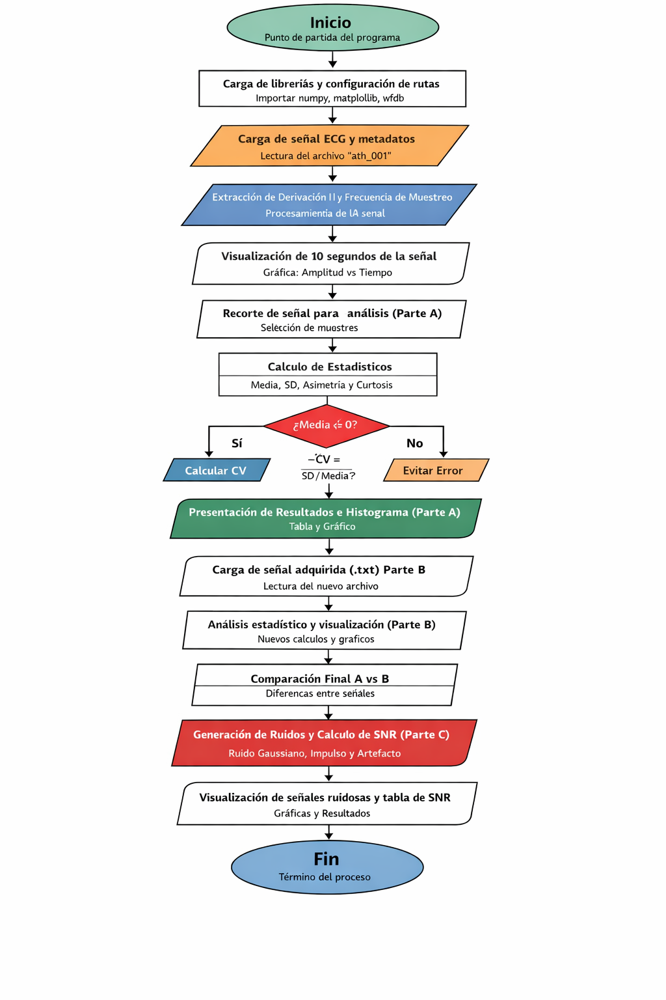
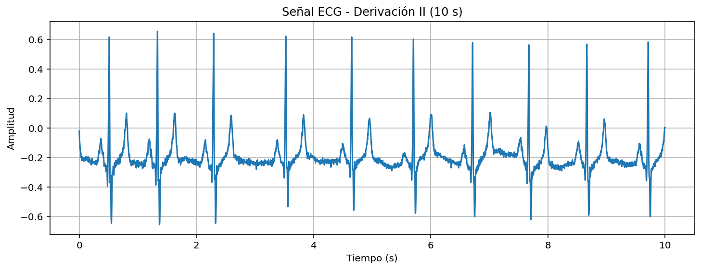
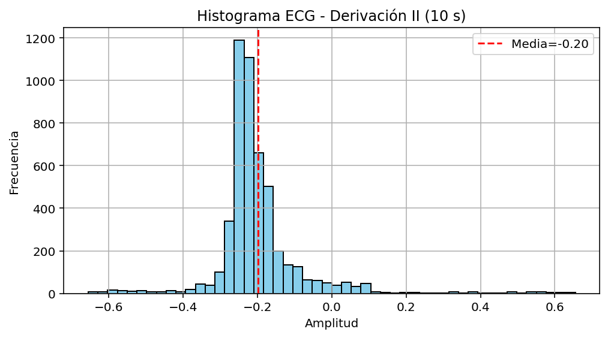
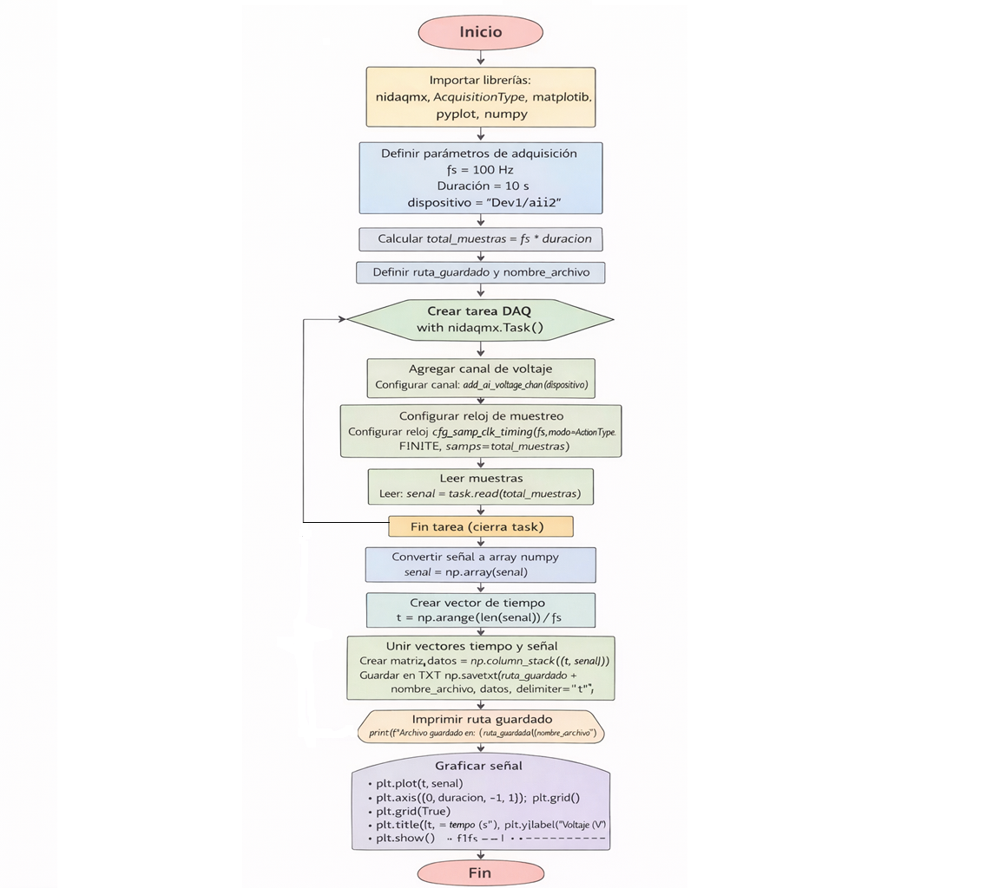
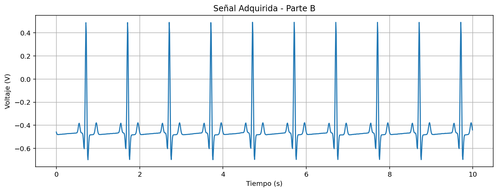

# Análisis Estadístico de Señales

## Asignatura

Procesamiento Digital de Señales

## Programa

Ingeniería Biomédica – Universidad Militar Nueva Granada

## Práctica de laboratorio

**Análisis estadístico de señales biomédicas**

## Integrantes

Danna Jimena Medina Ríos – Código 5600923
María José Polo Tovar – Código 5600894

---

## Descripción

Este proyecto presenta el código desarrollado para descargar, procesar y analizar estadísticamente señales fisiológicas. Incluye el cálculo de parámetros de estadística descriptiva, la comparación entre señales reales y generadas, y la evaluación de la relación señal-ruido (SNR) bajo distintos tipos de contaminación.

---

## Señal fisiológica

Se utilizó la base de datos *Norwegian Endurance Athlete ECG Database*, disponible en PhysioNet. Esta base reúne electrocardiogramas (ECG) de 12 derivaciones registrados en reposo a 28 atletas noruegos de resistencia de alto rendimiento.

Cada señal tiene una duración de 10 segundos y fue adquirida con una frecuencia de muestreo de 500 Hz. El propósito del estudio es analizar las adaptaciones cardíacas asociadas al entrenamiento intenso (remodelación cardíaca del atleta) y facilitar la diferenciación entre cambios fisiológicos normales y posibles alteraciones patológicas.

Además, cada ECG fue interpretado tanto por un sistema automático como por un cardiólogo especializado, lo que permite comparar el análisis computacional con la evaluación clínica experta.

---

## Metodología

El desarrollo del laboratorio se dividió en tres partes principales. En cada etapa se emplearon herramientas de programación en Python para el procesamiento y análisis de las señales biomédicas.

En primer lugar, se realizó la importación y visualización de una señal fisiológica descargada desde una base de datos pública. Posteriormente, se calcularon parámetros estadísticos descriptivos tanto de forma manual como utilizando funciones predefinidas del lenguaje. Finalmente, se adquirió una señal real y se evaluó el efecto de diferentes tipos de ruido mediante el cálculo de la relación señal-ruido (SNR).

### Parte A

En esta parte del trabajo se realiza el análisis de una señal electrocardiográfica (ECG) obtenida desde una base de datos pública en formato WFDB. El objetivo principal es caracterizar estadísticamente la señal y comprender su comportamiento temporal y probabilístico antes de compararla con una señal adquirida experimentalmente.

  

  <em>Diagrama de flujo completo código principal</em>

## Explicación del código

En esta sección se explica el funcionamiento del código utilizado para el análisis estadístico de una señal fisiológica descargada desde PhysioNet.

### Importación de librerías

Primero se importan las librerías necesarias para la lectura, el procesamiento y la visualización de la señal biomédica:

* `os`: permite gestionar rutas y archivos dentro del sistema operativo.
* `wfdb`: se utiliza para leer señales fisiológicas en formato WFDB, común en bases de datos como PhysioNet.
* `numpy`: facilita el manejo de arreglos y operaciones numéricas.
* `matplotlib.pyplot`: se emplea para generar gráficos.
* `scipy.stats`: permite calcular parámetros estadísticos como asimetría y curtosis.

Estas herramientas son fundamentales para el análisis de señales biomédicas en Python.

---

### Carga de la señal fisiológica

Luego se define la ruta donde se encuentran los archivos del ECG descargado y se lee el registro mediante la función `rdsamp` de `wfdb`. Esta función permite obtener tanto los valores de la señal como la información asociada al registro, por ejemplo, la frecuencia de muestreo.

Como el registro tiene 12 derivaciones, se selecciona una derivación específica: la Derivación II. Esta es una de las más utilizadas en el análisis electrocardiográfico, ya que permite visualizar con claridad el complejo QRS.

  

  <em>Grafica ECG  PhysioNet</em>

  ---

### Extracción de parámetros temporales

Una vez cargada la señal, se obtiene la frecuencia de muestreo a partir de los metadatos del registro. Con este dato se calcula cuántas muestras corresponden a un intervalo de 10 segundos, lo que permite trabajar con un segmento temporal definido para el análisis.

También se construye un vector de tiempo que relaciona cada muestra con su instante correspondiente.

---

### Visualización de la señal

El código grafica un segmento de 10 segundos del ECG seleccionado. Esta visualización permite hacer una inspección inicial de la señal, identificando aspectos como la periodicidad del ritmo cardíaco, la amplitud de los complejos QRS y la posible presencia de ruido o artefactos.

Antes de realizar cualquier análisis cuantitativo, esta revisión visual es importante para comprobar que la señal tiene una calidad adecuada.

---

### Recorte de la señal

Para el análisis estadístico, se recorta la señal al segmento previamente definido. De esta manera, los cálculos se realizan sobre un número controlado de muestras y en un intervalo temporal uniforme.

---

### Cálculo manual de los estadísticos descriptivos

En esta etapa se implementan manualmente las fórmulas matemáticas de los principales estadísticos descriptivos:

* **Media**: promedio de los valores de la señal, representa el valor central.
* **Desviación estándar**: indica qué tan dispersos están los valores respecto a la media.
* **Coeficiente de variación**: relaciona la desviación estándar con la media y permite evaluar la variabilidad relativa.
* **Asimetría (skewness)**: muestra si la distribución de los valores está sesgada hacia la derecha o hacia la izquierda.
* **Curtosis**: describe el grado de concentración o dispersión de los valores alrededor de la media.

Realizar estos cálculos de forma manual ayuda a comprender mejor el significado matemático de cada parámetro y su relación con la forma de la señal.

---

### Cálculo mediante funciones predefinidas

Posteriormente, los mismos estadísticos se calculan usando funciones de `numpy` y `scipy.stats`. Este enfoque simplifica el código y mejora la eficiencia, además de servir para verificar que los resultados obtenidos manualmente son correctos.

Al comparar ambos métodos, se observa coherencia en los resultados, lo que confirma la adecuada implementación de las fórmulas.

---
## Histograma Parte A

Finalmente, se genera un histograma de la señal adquirida para analizar la distribución de sus amplitudes. Este gráfico permite identificar la dispersión de los datos y la posible presencia de valores atípicos asociados a ruido o interferencias.

Se incluye una línea vertical que representa la media, facilitando la interpretación visual de la distribución estadística.

  

  <em>Histograma Parte A </em>

---

### Parte B

En esta parte del trabajo se realiza el análisis de una señal fisiológica adquirida experimentalmente mediante un sistema de adquisición de datos (DAQ). El objetivo principal es caracterizar estadísticamente una señal real, analizar su comportamiento temporal y probabilístico, y comparar estos resultados con los obtenidos a partir de la señal descargada desde la base de datos en la Parte A.

las librerías necesarias para la adquisición, el procesamiento y la visualización de la señal, ademas de las ya utilizadas son:

* `nidaqmx`: permite la comunicación con la tarjeta de adquisición de datos y la captura de señales analógicas.

Esta herramienta permiten integrar la adquisición experimental con el procesamiento estadístico en Python.

---

### Adquisición de la señal fisiológica

La adquisición de la señal se realizó mediante un código independiente desarrollado específicamente para la captura de datos utilizando una tarjeta DAQ. Este script externo se encargó de configurar los parámetros de adquisición, como la frecuencia de muestreo, la duración del registro y la selección del canal de entrada analógica.

Como resultado del proceso de captura, se generó un archivo en formato TXT que contiene dos columnas: tiempo (s) y voltaje (V).

  

  <em>Señal Captura de datos </em>

El código principal del proyecto no realiza la adquisición directamente, sino que utiliza como entrada el archivo TXT generado por el script de captura. A partir de este archivo, se lleva a cabo el procesamiento y análisis.

---

### Extracción de parámetros temporales

Con base en la frecuencia de muestreo utilizada durante la adquisición, se construye un vector de tiempo que asocia cada muestra con su instante correspondiente. Este vector permite representar correctamente la señal en el dominio temporal.

---

### Visualización de la señal

El código grafica la señal adquirida en función del tiempo. Esta visualización permite verificar que la adquisición se haya realizado correctamente y observar características propias de una señal real, como la presencia de ruido, variaciones en la amplitud y posibles artefactos.

La inspección visual es un paso clave antes de realizar el análisis estadístico.

  

  <em> Señal ECG adquirida </em>

---

### Recorte de la señal

Para el análisis estadístico se utiliza el segmento completo correspondiente al intervalo de adquisición definido. De esta manera, los cálculos se realizan sobre una señal representativa del proceso experimental.

---

### Cálculo de los estadísticos descriptivos

Sobre la señal adquirida se calculan los principales parámetros estadísticos descriptivos:

* **Media**: representa el valor promedio de la señal.
* **Desviación estándar**: indica el grado de dispersión de los valores respecto a la media.
* **Coeficiente de variación**: permite evaluar la variabilidad relativa de la señal.
* **Asimetría (skewness)**: describe la inclinación de la distribución de los valores.
* **Curtosis**: indica el grado de concentración o dispersión de los datos alrededor de la media.

Estos parámetros permiten cuantificar el efecto del ruido y de las condiciones reales de adquisición sobre la señal fisiológica.

---

### Histograma señal adquirida

Finalmente, se genera un histograma de la señal adquirida para analizar la distribución de sus amplitudes. Este gráfico permite observar la dispersión de los datos y la posible presencia de valores atípicos asociados al ruido o a interferencias.

Se incluye una línea vertical que representa la media, lo que facilita la interpretación visual de la distribución estadística.

  

  <em> Histograma de la señal adquirida </em>

---

