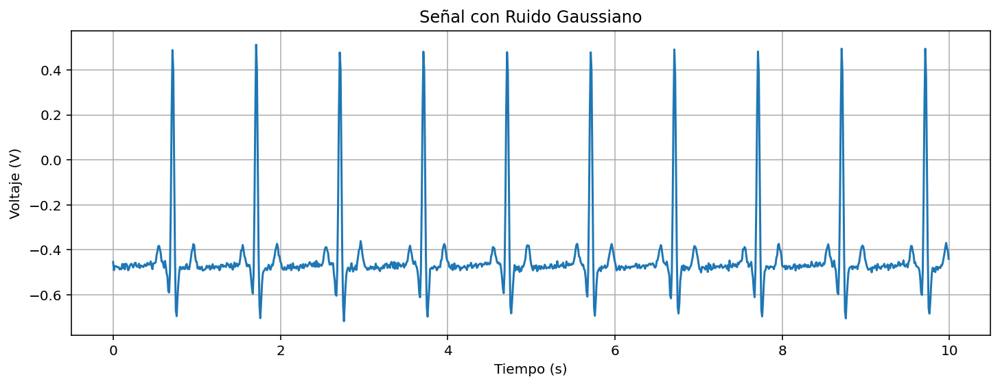
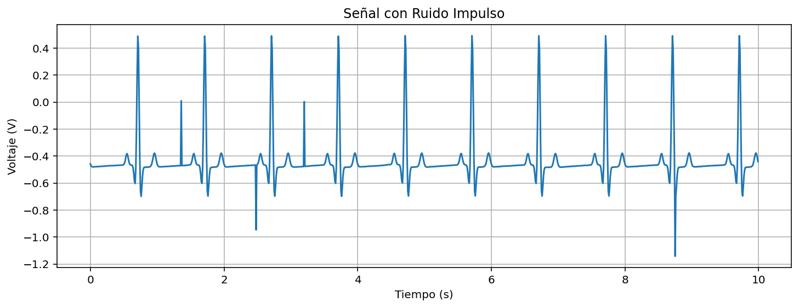
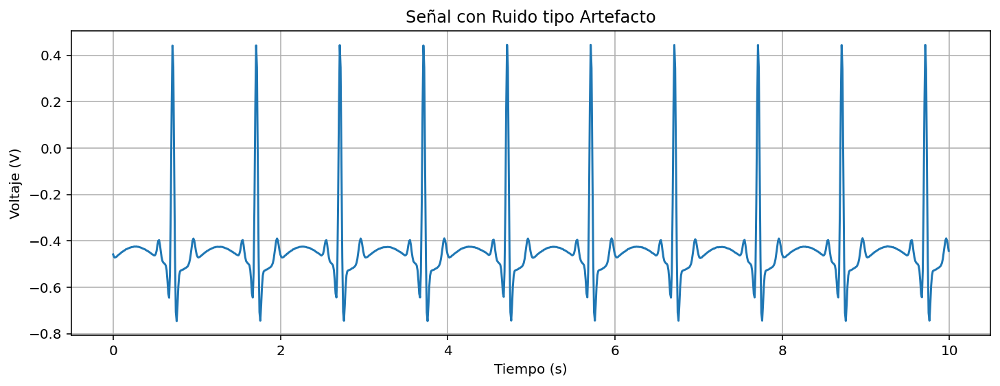

# Análisis Estadístico de Señales

## Asignatura

Procesamiento Digital de Señales

## Programa

Ingeniería Biomédica – Universidad Militar Nueva Granada

## Práctica de laboratorio

**Análisis estadístico de señales biomédicas**

## Integrantes

Danna Jimena Medina Ríos – Código 5600923
María José Polo Tovar – Código 5600894

---

## Descripción

Este proyecto presenta el código desarrollado para descargar, procesar y analizar estadísticamente señales fisiológicas. Incluye el cálculo de parámetros de estadística descriptiva, la comparación entre señales reales y generadas, y la evaluación de la relación señal-ruido (SNR) bajo distintos tipos de contaminación.

---

## Señal fisiológica

Se utilizó la base de datos *Norwegian Endurance Athlete ECG Database*, disponible en PhysioNet. Esta base reúne electrocardiogramas (ECG) de 12 derivaciones registrados en reposo a 28 atletas noruegos de resistencia de alto rendimiento.

Cada señal tiene una duración de 10 segundos y fue adquirida con una frecuencia de muestreo de 500 Hz. El propósito del estudio es analizar las adaptaciones cardíacas asociadas al entrenamiento intenso (remodelación cardíaca del atleta) y facilitar la diferenciación entre cambios fisiológicos normales y posibles alteraciones patológicas.

Además, cada ECG fue interpretado tanto por un sistema automático como por un cardiólogo especializado, lo que permite comparar el análisis computacional con la evaluación clínica experta.

---

## Metodología

El desarrollo del laboratorio se dividió en tres partes principales. En cada etapa se emplearon herramientas de programación en Python para el procesamiento y análisis de las señales biomédicas.

En primer lugar, se realizó la importación y visualización de una señal fisiológica descargada desde una base de datos pública. Posteriormente, se calcularon parámetros estadísticos descriptivos tanto de forma manual como utilizando funciones predefinidas del lenguaje. Finalmente, se adquirió una señal real y se evaluó el efecto de diferentes tipos de ruido mediante el cálculo de la relación señal-ruido (SNR).

### Parte A

En esta parte del trabajo se realiza el análisis de una señal electrocardiográfica (ECG) obtenida desde una base de datos pública en formato WFDB. El objetivo principal es caracterizar estadísticamente la señal y comprender su comportamiento temporal y probabilístico antes de compararla con una señal adquirida experimentalmente.
<p align="center">
  
</p>

<p align="center">
  <em>Diagrama de flujo completo código principal</em>
</p>

---

## Explicación del código

En esta sección se explica el funcionamiento del código utilizado para el análisis estadístico de una señal fisiológica descargada desde PhysioNet.

### Importación de librerías

Primero se importan las librerías necesarias para la lectura, el procesamiento y la visualización de la señal biomédica:

* `os`: permite gestionar rutas y archivos dentro del sistema operativo.
* `wfdb`: se utiliza para leer señales fisiológicas en formato WFDB, común en bases de datos como PhysioNet.
* `numpy`: facilita el manejo de arreglos y operaciones numéricas.
* `matplotlib.pyplot`: se emplea para generar gráficos.
* `scipy.stats`: permite calcular parámetros estadísticos como asimetría y curtosis.

Estas herramientas son fundamentales para el análisis de señales biomédicas en Python.

---

### Carga de la señal fisiológica

Luego se define la ruta donde se encuentran los archivos del ECG descargado y se lee el registro mediante la función `rdsamp` de `wfdb`. Esta función permite obtener tanto los valores de la señal como la información asociada al registro, por ejemplo, la frecuencia de muestreo.

```python
directory = r"C:/Users/Usuario/Downloads/Procesamiento de señales/LAB 1/"
record = wfdb.rdsamp(os.path.join(directory, "ath_001"))
```

Como el registro tiene 12 derivaciones, se selecciona una derivación específica: la Derivación II. Esta es una de las más utilizadas en el análisis electrocardiográfico, ya que permite visualizar con claridad el complejo QRS.

<p align="center">
  
<p align="center">
  <em>Grafica ECG  PhysioNet</em>

  ---

### Extracción de parámetros temporales

Una vez cargada la señal, se obtiene la frecuencia de muestreo a partir de los metadatos del registro. Con este dato se calcula cuántas muestras corresponden a un intervalo de 10 segundos, lo que permite trabajar con un segmento temporal definido para el análisis.

También se construye un vector de tiempo que relaciona cada muestra con su instante correspondiente.

---

### Visualización de la señal

El código grafica un segmento de 10 segundos del ECG seleccionado. Esta visualización permite hacer una inspección inicial de la señal, identificando aspectos como la periodicidad del ritmo cardíaco, la amplitud de los complejos QRS y la posible presencia de ruido o artefactos.

Antes de realizar cualquier análisis cuantitativo, esta revisión visual es importante para comprobar que la señal tiene una calidad adecuada.

---

### Recorte de la señal

Para el análisis estadístico, se recorta la señal al segmento previamente definido. De esta manera, los cálculos se realizan sobre un número controlado de muestras y en un intervalo temporal uniforme.

---

### Cálculo manual de los estadísticos descriptivos

En esta etapa se implementan manualmente las fórmulas matemáticas de los principales estadísticos descriptivos:

* **Media**: promedio de los valores de la señal, representa el valor central.


  ```python
#  Media 
suma = 0
for i in range(N):
    suma += senal_cortada[i]

media_manual = suma / N

```

* **Desviación estándar**: indica qué tan dispersos están los valores respecto a la media.
* **Coeficiente de variación**: relaciona la desviación estándar con la media y permite evaluar la variabilidad relativa.
* **Asimetría (skewness)**: muestra si la distribución de los valores está sesgada hacia la derecha o hacia la izquierda.
* **Curtosis**: describe el grado de concentración o dispersión de los valores alrededor de la media.

Realizar estos cálculos de forma manual ayuda a comprender mejor el significado matemático de cada parámetro y su relación con la forma de la señal.

---

### Cálculo mediante funciones predefinidas

Posteriormente, los mismos estadísticos se calculan usando funciones de `numpy` y `scipy.stats`. Este enfoque simplifica el código y mejora la eficiencia, además de servir para verificar que los resultados obtenidos manualmente son correctos.

Al comparar ambos métodos, se observa coherencia en los resultados, lo que confirma la adecuada implementación de las fórmulas.


```python
media_lib = np.mean(senal_cortada)
desv_lib = np.std(senal_cortada)

```


---
## Histograma Parte A

Finalmente, se genera un histograma de la señal adquirida para analizar la distribución de sus amplitudes. Este gráfico permite identificar la dispersión de los datos y la posible presencia de valores atípicos asociados a ruido o interferencias.

Se incluye una línea vertical que representa la media, facilitando la interpretación visual de la distribución estadística.
<p align="center">
  
</p>

<p align="center">
  <em>Histograma Parte A </em>
</p>

---

### Parte B

En esta parte del trabajo se realiza el análisis de una señal fisiológica adquirida experimentalmente mediante un sistema de adquisición de datos (DAQ). El objetivo principal es caracterizar estadísticamente una señal real, analizar su comportamiento temporal y probabilístico, y comparar estos resultados con los obtenidos a partir de la señal descargada desde la base de datos en la Parte A.

las librerías necesarias para la adquisición, el procesamiento y la visualización de la señal, ademas de las ya utilizadas son:

* `nidaqmx`: permite la comunicación con la tarjeta de adquisición de datos y la captura de señales analógicas.

Esta herramienta permiten integrar la adquisición experimental con el procesamiento estadístico en Python.

---

### Adquisición de la señal DAQ
La adquisición de la señal se realizó mediante un código independiente desarrollado específicamente para la captura de datos utilizando una tarjeta DAQ. Este script externo se encargó de configurar los parámetros de adquisición, como la frecuencia de muestreo, la duración del registro y la selección del canal de entrada analógica.

Como resultado del proceso de captura, se generó un archivo en formato TXT que contiene dos columnas: tiempo (s) y voltaje (V).

<p align="center">
  
</p>

<p align="center">
  <em>Diagrama de flujo Captura de datos </em>
</p>

El código principal del proyecto no realiza la adquisición directamente, sino que utiliza como entrada el archivo TXT generado por el script de captura. A partir de este archivo, se lleva a cabo el procesamiento y análisis.

---

### Extracción de parámetros temporales

Con base en la frecuencia de muestreo utilizada durante la adquisición, se construye un vector de tiempo que asocia cada muestra con su instante correspondiente. Este vector permite representar correctamente la señal en el dominio temporal.

---

### Visualización de la señal

El código grafica la señal adquirida en función del tiempo. Esta visualización permite verificar que la adquisición se haya realizado correctamente y observar características propias de una señal real, como la presencia de ruido, variaciones en la amplitud y posibles artefactos.

La inspección visual es un paso clave antes de realizar el análisis estadístico.

<p align="center">
  
</p>

<p align="center">
  <em> Señal ECG adquirida </em>
</p>

---

### Recorte de la señal

Para el análisis estadístico se utiliza el segmento completo correspondiente al intervalo de adquisición definido. De esta manera, los cálculos se realizan sobre una señal representativa del proceso experimental.

---

### Cálculo de los estadísticos descriptivos

Sobre la señal adquirida se calculan los principales parámetros estadísticos descriptivos:

* **Media**: representa el valor promedio de la señal.
* **Desviación estándar**: indica el grado de dispersión de los valores respecto a la media.
* **Coeficiente de variación**: permite evaluar la variabilidad relativa de la señal.
* **Asimetría (skewness)**: describe la inclinación de la distribución de los valores.
* **Curtosis**: indica el grado de concentración o dispersión de los datos alrededor de la media.

Estos parámetros permiten cuantificar el efecto del ruido y de las condiciones reales de adquisición sobre la señal fisiológica.

---

### Histograma señal adquirida

Finalmente, se genera un histograma de la señal adquirida para analizar la distribución de sus amplitudes. Este gráfico permite observar la dispersión de los datos y la posible presencia de valores atípicos asociados al ruido o a interferencias.

Se incluye una línea vertical que representa la media, lo que facilita la interpretación visual de la distribución estadística.

<p align="center">
  
</p>

<p align="center">
  <em> Histograma de la señal adquirida </em>
</p>

---
### Parte C 

En esta parte del trabajo se desarrolla el cálculo de la relación señal-ruido ( SNR) como una herramienta cuantitativa para evaluar la calidad de una señal fisiológica cuando es afectada por diferentes tipos de ruido.

El procedimiento consiste en tomar la señal fisiológica de la parte B y generar versiones contaminadas artificialmente mediante la adición de distintos tipos de ruido. A partir de estas señales, se calcula la SNR con el fin de disponer de un parámetro numérico que describa la relación entre la potencia de la señal útil y la potencia del ruido añadido.

```python
def calcular_snr(senal, ruido):
    potencia_senal = np.mean(senal**2)
    potencia_ruido = np.mean(ruido**2)
    snr = 10 * np.log10(potencia_senal / potencia_ruido)
    return snr

```


---

### Selección de la señal de referencia

El código inicia con la selección de una señal fisiológica previamente cargada, la cual se considera como señal de referencia  en archivos .txt . Esta señal representa la información útil y se emplea como base para todos los cálculos posteriores. A partir de esta señal se obtiene la potencia asociada a la señal original, necesaria para el cálculo de la SNR.

---

### Generación de señales de ruido

Posteriormente, el código genera diferentes tipos de ruido artificial con el propósito de simular condiciones reales de adquisición de señales biomédicas. Entre los ruidos generados se incluyen:

* **Ruido blanco gaussiano**, caracterizado por una distribución normal y utilizado comúnmente para modelar ruido electrónico.
* **Ruido impulsivo**, que simula interferencias repentinas y de corta duración.
  ```python
ruido_impulso = np.zeros(N)
prob = 0.01  # probabilidad de impulso

for i in range(N):
    if np.random.rand() < prob:
        ruido_impulso[i] = np.random.choice([-1,1]) * 3*np.std(senal_original)

senal_impulso = senal_original + ruido_impulso

snr_impulso = calcular_snr(senal_original, ruido_impulso)

```
* **Ruido de baja frecuencia**, asociado a variaciones lentas o desplazamientos de la línea base.

Cada señal de ruido se genera de forma independiente y con parámetros ajustables, lo que permite controlar su influencia sobre la señal fisiológica.

<p align="center">
  
<p align="center">
  <em>Ruido gaussiano</em>

---

### Contaminación de la señal fisiológica

Una vez generadas las señales de ruido, estas se suman a la señal fisiológica original. Este proceso da como resultado señales contaminadas que conservan la información original, pero incorporan perturbaciones artificiales. La finalidad de este procedimiento es disponer de diferentes versiones de la señal bajo condiciones controladas de ruido.
<p align="center">
  
<p align="center">
  <em>Ruido impulso</em>

---

### Cálculo de la relación señal-ruido (SNR)

Para cada señal contaminada, el código calcula la relación señal-ruido utilizando la potencia de la señal de referencia y la potencia del ruido añadido. La SNR se expresa en decibelios (dB), lo que permite representar la relación entre señal y ruido en una escala logarítmica.

Este cálculo se realiza de manera sistemática para cada tipo de ruido generado.

---

### Visualización de las señales

Finalmente, el código genera gráficas que muestran la señal fisiológica original junto con las señales contaminadas. Estas visualizaciones permiten verificar de forma gráfica el efecto del ruido añadido sobre la señal, así como comprobar el correcto funcionamiento del proceso de contaminación y del cálculo de la SNR.
<p align="center">
  
<p align="center">
  <em>Ruido tipo artefacto</em>

  ---
  

### Analisis de resultados y preguntas 

Los valores estadísticos calculados sobre la señal sintética no son exactamente iguales a los obtenidos a partir de la señal real, debido a diferencias tanto en el offset como en la naturaleza de cada señal. La señal sintética presentaba un offset aproximado de −0,4, mientras que la señal real tenía un offset cercano a −0,2, lo cual explica directamente la diferencia en la media, ya que este parámetro refleja el desplazamiento vertical de la señal. Además, la desviación estándar muestra que la señal sintética tiene mayor dispersión que la real, lo que indica una variabilidad distinta en sus amplitudes. Las diferencias más notables se observan en la asimetría y la curtosis, parámetros que dependen fuertemente de la forma de la distribución de los datos; al ser la señal sintética generada artificialmente y posiblemente contaminada con ruido específico, puede presentar picos más pronunciados o una distribución más sesgada en comparación con la señal real, que contiene variaciones fisiológicas propias del sistema cardiovascular.

En términos generales, el análisis estadístico completo evidencia que, aunque ambas señales representan un ECG, su comportamiento cuantitativo no es idéntico. La comparación de media, desviación estándar, asimetría y curtosis permite identificar diferencias en el desplazamiento, la variabilidad y la forma de la distribución de amplitudes, lo que confirma que las condiciones de generación o adquisición influyen directamente en las características estadísticas de la señal. La señal real, al provenir de un proceso fisiológico y de un sistema de adquisición físico, incorpora variaciones naturales y posibles interferencias del entorno, mientras que la señal sintética depende del modelo matemático y de los parámetros utilizados para su construcción.

Por otra parte, el tipo de ruido sí afecta el valor de la SNR calculado, ya que esta relación depende de la potencia del ruido añadido respecto a la potencia de la señal útil. Un ruido blanco gaussiano distribuye su energía de manera uniforme en el espectro, el ruido impulsivo introduce picos de alta amplitud que incrementan considerablemente la potencia del ruido, y el ruido de baja frecuencia altera la línea base de la señal; cada uno modifica la potencia total del componente no deseado de forma distinta, generando variaciones en la SNR. En consecuencia, la SNR no solo cuantifica la calidad de la señal, sino que también refleja cómo diferentes tipos de contaminación pueden afectar la interpretación clínica y la confiabilidad del análisis biomédico.

---
### Alcance de los parámetros estadísticos en la detección de patologías

Los parámetros estadísticos descriptivos permiten caracterizar globalmente una señal biomédica sin depender de la identificación de puntos fiduciales específicos, como el pico R en el ECG. Esto representa una ventaja en situaciones donde la señal está contaminada o cuando la detección automática de eventos presenta errores.

En el contexto clínico, parámetros como la desviación estándar, la asimetría y la curtosis pueden reflejar alteraciones en la morfología del ECG asociadas a cambios fisiológicos o patológicos. Por ejemplo, una mayor variabilidad podría relacionarse con arritmias, mientras que cambios en la curtosis podrían indicar presencia de picos anómalos o complejos ventriculares prematuros.

Sin embargo, estos parámetros no permiten identificar directamente el tipo de patología, ya que describen propiedades globales de la señal y no eventos específicos del ciclo cardíaco. Por tanto, su utilidad clínica es principalmente complementaria y no diagnóstica por sí sola.

---
### Limitaciones en la detección de patologías

El uso exclusivo de parámetros estadísticos presenta varias limitaciones:

- No distingue entre cambios fisiológicos normales y alteraciones patológicas.

- Es altamente dependiente de la ventana temporal seleccionada.

- Puede verse afectado por ruido y artefactos.

- No considera la información morfológica detallada del ECG.

- Existe alta variabilidad interindividual, lo que dificulta establecer valores umbral universales.

Por lo tanto, aunque los estadísticos descriptivos aportan información cuantitativa relevante, deben complementarse con análisis temporal, espectral o clínico para una interpretación diagnóstica adecuada.

---
### Alcance y limitaciones para evaluar calidad de señal

La relación señal-ruido (SNR) es una herramienta útil para cuantificar objetivamente la calidad de una señal biomédica. Una mayor SNR indica que la potencia de la señal útil es significativamente superior a la del ruido, lo cual facilita el análisis automático y clínico.

No obstante, una SNR elevada no garantiza necesariamente que la señal sea clínicamente interpretable, ya que ciertos tipos de ruido, como el impulsivo, pueden alterar la morfología del ECG aun cuando su potencia promedio no sea dominante.

Además, la SNR no distingue entre tipos de contaminación ni identifica si el ruido afecta regiones críticas de la señal, como el complejo QRS o el segmento ST. Por ello, la evaluación de calidad debe considerar tanto métricas cuantitativas como inspección visual y análisis contextual.

---
### Conclusiones

- Se logró caracterizar estadísticamente señales fisiológicas reales y sintéticas mediante el cálculo de parámetros descriptivos como media, desviación estándar, coeficiente de variación, asimetría y curtosis.

- Se evidenció que las condiciones de adquisición influyen directamente en los valores estadísticos obtenidos, mostrando diferencias entre una señal descargada desde una base de datos y una señal adquirida experimentalmente.

- Se comprobó que el tipo de ruido añadido afecta significativamente la relación señal-ruido (SNR), demostrando que distintos mecanismos de contaminación impactan de forma diferente la potencia del componente no deseado.

- Aunque los parámetros estadísticos permiten describir globalmente una señal biomédica y evaluar su calidad, su uso aislado no es suficiente para establecer diagnósticos clínicos, ya que no capturan completamente la información morfológica y fisiológica del ECG.

- Las técnicas aplicadas en esta práctica constituyen una base fundamental para el procesamiento digital de señales biomédicas y resaltan la importancia de integrar análisis estadístico, conocimiento fisiológico y evaluación experimental para una interpretación adecuada.


